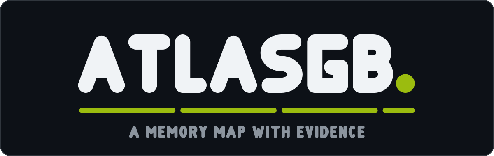

<p align="center">
  
</p>

<!-- atlas:begin (badges) — generated by tools/render.py from the atlas data; edit the data, not the table -->

<p align="center">
  <a href="https://github.com/Alchemy86/AtlasGB/actions/workflows/ci.yml"></a>
  <a href="LICENSE-CC-BY-SA"></a>
  <a href="LICENSE"></a>
  <a href="atlases/"></a>
  <a href="atlases/pokemon-rb/data/atlas.tsv"></a>
</p>

<!-- atlas:end (badges) -->

**Memory maps for Game Boy cartridges that carry the evidence for every claim they make.**
One atlas per cartridge. **One is published so far: [Pokémon Red and
Blue](atlases/pokemon-rb/).**

### → **[Pokémon Red and Blue](atlases/pokemon-rb/)** — 2,898 evidenced claims

**[the data](atlases/pokemon-rb/data/atlas.tsv)** ·
**[by address](atlases/pokemon-rb/docs/by-address.md)** ·
**[by name](atlases/pokemon-rb/docs/by-name.md)** ·
**[the structures](atlases/pokemon-rb/docs/structures.md)**

Project-wide: **[the schema](docs/schema.md)** · **[using it](docs/consuming.md)** ·
**[verification](docs/verification.md)** · **[adding an atlas](docs/adding-an-atlas.md)**

---

## Why this exists

Memory maps for these games already exist. The disassemblies have their `wram.asm`; the
wikis have tables; the cheat-code sites have lists.

**They are transcriptions.** Somebody read an address once and everybody since has copied
it, and there is no way, from inside any of them, to tell a right address from a plausible
one. A map like that is not wrong so much as **unauditable** — you cannot ask it *how do
you know?*, so a typo made in 2004 is still there, indistinguishable from the 2,000
correct rows around it.

AtlasGB is different in exactly one way, and it is the whole point: **every claim carries
its evidence.** Each entry records how it was checked — and the entries with no evidence at
all say so, rather than borrowing confidence from the rows beside them.

That is possible because the evidence is produced by a cycle-accurate emulator that runs
the cartridge and watches what it does. See [how an entry is proved](docs/verification.md).

**That promise belongs to the project, not to one file.** Every atlas added here inherits
it, which is exactly why there is room for more.

### Where the findings are written down

An entry says *what* an address is for. The reasoning behind it — the symptom, the wrong
turns, the measurement that settled it — does not fit in a cell, so it is recorded once
next door: **the findings that back these descriptions live in this atlas's own discoveries
page**,
**[atlases/pokemon-rb/docs/discoveries.md](atlases/pokemon-rb/docs/discoveries.md)**
— twenty-eight findings about Pokémon Red/Blue, each with the evidence that produced it.
Documenting the game's own behaviour is this project's job; the discoveries page moved here
from TerminalGB, the emulator that produces the verification runs behind them, because that
is where it belongs. Four sibling pages made the same move for the same reason:
[sharp edges](atlases/pokemon-rb/docs/sharp-edges.md) (the same findings as traps, grouped by
what you were doing when they bite), [a paper's claims, checked](atlases/pokemon-rb/docs/paper-claims.md),
[catching](atlases/pokemon-rb/docs/catching.md) and [Cerulean Gym, worked](atlases/pokemon-rb/docs/cerulean-gym.md) —
see [the atlas's own guides section](atlases/pokemon-rb/README.md#guides).

Six chapter pages carry a **Findings behind these bytes** table linking into it:

| chapter | the findings it points at |
|---|---|
| **[battle](atlases/pokemon-rb/docs/battle.md)** | what the battle-status bytes and the in-battle sentinels were watched doing |
| **[overworld](atlases/pokemon-rb/docs/overworld.md)** | `wCurMap` and the coordinates — the bytes this project has been wrong about most often |
| **[scratch](atlases/pokemon-rb/docs/scratch.md)** | shared scratch bytes that matter for something other than their name |
| **[screen](atlases/pokemon-rb/docs/screen.md)** | the menu cursor and tile-map findings that never announce themselves |
| **[sprites](atlases/pokemon-rb/docs/sprites.md)** | the object-buffer overrun that stamps tiles into the map |
| **[events](atlases/pokemon-rb/docs/events.md)** | the blackout carve-out behind the one described map script |

Written descriptions cover **628 of the 1,012 distinct addresses**, and **666 entries and
aliases are deliberately blank**: this project cannot yet describe them honestly, and a
plausible sentence derived from a symbol name is the thing it exists as a reaction to. 136
of the written descriptions were generated by watching a real playthrough, not found by
reading — see [how](docs/observation.md).

---

## The atlases

<!-- atlas:begin (atlases) — generated by tools/render.py from the atlas data; edit the data, not the table -->

| atlas | what it maps | claims | evidence | pages |
|---|---|---:|---|---|
| **[Pokémon Red and Blue](atlases/pokemon-rb/)** | Pokémon Blue (English, USA/Europe)<br>Pokémon Red (English, USA/Europe) | 2,898 | R 1,594 · L 2,694 · I 36 · 7 unevidenced | [by address](atlases/pokemon-rb/docs/by-address.md) · [by name](atlases/pokemon-rb/docs/by-name.md) |

<!-- atlas:end (atlases) -->

One directory per cartridge, under [`atlases/`](atlases/). Each one owns its own data, its
own pages, and a `meta.json` saying which game it is about — so a second cartridge is a new
sibling directory, never a merge into a global file.

```
atlases/pokemon-rb/
  meta.json              which game, which engine, which disassembly
  README.md              that atlas's front page: evidence, coverage, chapters
  data/atlas.tsv         the source of truth for THAT cartridge
  data/atlas.json        generated from it, checked in CI
  data/evidence.json     which verification run its tiers came from
  docs/                  its chapters, its two indexes, its structures
```

### What is here today

**[Pokémon Red and Blue](atlases/pokemon-rb/)**, English (USA/Europe) — the whole address
space, 2,898 claims, work RAM and high RAM 100% accounted for with no holes. Red and Blue
build from one source and share their work RAM map, so it is one atlas covering both.

### What is not

- **Pokémon Yellow.** Its work RAM shifted, so an address from the Red/Blue atlas is
  *wrong* there rather than approximately right. It needs its own build, its own extraction
  and its own verification run. The machinery would do it; nobody has.
- **Generation 2, and every other cartridge.** Different engine, different map — which in
  this layout means a different directory under `atlases/`, not an extension of an existing
  one.
- **Anything unevidenced, presented as evidenced.** There is no atlas here that was
  transcribed rather than proved, and there will not be one.

### Adding one

**[docs/adding-an-atlas.md](docs/adding-an-atlas.md)** is the guide: the schema to fill,
how the evidence tiers are earned, what the extractor has to produce, and what a
contributor would actually have to hand over. It is deliberately explicit about the part
that is hard — the evidence — because an atlas without it is the transcription this project
exists to replace.

---

## What is shared, and what belongs to an atlas

The reason a second atlas is cheap is that only the *data* is per-cartridge. Everything
that makes the data trustworthy is written once.

| shared by every atlas | owned by one atlas |
|---|---|
| [`schema/atlas.schema.json`](schema/atlas.schema.json) — the JSON contract | `atlases/<id>/data/atlas.tsv` — the source of truth |
| [`docs/schema.md`](docs/schema.md) — the column-by-column contract | `atlases/<id>/data/atlas.json`, `atlas.min.json` |
| [`docs/verification.md`](docs/verification.md) — the tiers and the report format | `atlases/<id>/data/evidence.json` — the run behind its tiers |
| [`docs/consuming.md`](docs/consuming.md) and [`tools/fetch-atlas.sh`](tools/fetch-atlas.sh) | `atlases/<id>/meta.json` — which game it is |
| [`tools/`](tools/) — extract, render, export, validate | `atlases/<id>/docs/` — its chapters and indexes |
| [`docs/brand/`](docs/brand/README.md) — the mark | |

---

## Using it

Nothing here depends on any other project, and you do not have to run any of the tooling.

```bash
# the source of truth for the Pokémon Red/Blue atlas
curl -fsSLO https://raw.githubusercontent.com/Alchemy86/AtlasGB/main/atlases/pokemon-rb/data/atlas.tsv

# or the same rows as typed JSON, generated from it and checked in CI
curl -fsSLO https://raw.githubusercontent.com/Alchemy86/AtlasGB/main/atlases/pokemon-rb/data/atlas.json
```

```python
import csv

with open("atlas.tsv", encoding="utf-8", newline="") as f:
    atlas = {r["symbol"]: r for r in csv.DictReader(f, delimiter="\t")}

atlas["wPartyCount"]["addr"]      # '$D163'
atlas["wPartyCount"]["verify"]    # 'rom,live,inv'
```

```bash
# and it is a text file, so this works too
grep -P '\twParty' atlases/pokemon-rb/data/atlas.tsv
```

| you want | read |
|---|---|
| to parse the file | **[the schema](docs/schema.md)** — every column, its units, its allowed values |
| to build against it | **[consuming it](docs/consuming.md)** — vendoring, pinning, and the anti-drift gate |
| to trust it | **[verification](docs/verification.md)** — the tiers, the invariants, the loop |
| to add a cartridge | **[adding an atlas](docs/adding-an-atlas.md)** — what you would have to produce |
| to know where it came from | **[provenance](docs/provenance.md)** and **[licence](docs/licensing.md)** |

> **Paths moved when the repository was namespaced by game.** The data used to live at
> `data/atlas.tsv` and the chapter pages at `docs/<chapter>.md`, back when one atlas was
> the whole repository. They are now under `atlases/pokemon-rb/`. The rows did not change —
> a directory move relocates the file, it does not rewrite the data — so a pinned snapshot
> is still correct; only the URL a refresh fetches has changed.
> [`tools/fetch-atlas.sh`](tools/fetch-atlas.sh) grew `--atlas` and `--file` for exactly
> this. The full before/after list is in [`data/README.md`](data/README.md).

---

## Contributing

`make check` before you push. It is what CI runs, and it is red until every generated file
agrees with the data.

```bash
make check     # everything CI runs, across every atlas
make docs      # regenerate the pages and this README's tables
make data      # regenerate the JSON
make atlases   # list the atlases, as the tools see them
make help      # the rest
```

Per-atlas contributions — descriptions, a live script that reaches further into the game —
are described on the atlas's own page. A whole new cartridge is
[adding an atlas](docs/adding-an-atlas.md).

---

## Credit

The addresses, the symbol names and the structure layouts are **facts about the
cartridge**, derived from a built disassembly checkout — for the Red/Blue atlas, that is
[`pret/pokered`](https://github.com/pret/pokered). The names in particular are the
disassembly projects' work, built up over many years by many people, and they are the most
useful thing in these files; we did not invent them and we do not claim them. Their prose
and comments are not ours to copy, so every description here is written from scratch.

What is ours is the verification, the evidence tiers, the completeness accounting and the
chapter rules. The evidence is produced by
[TerminalGB](https://github.com/Alchemy86/TerminalGB), which consumes this project as a
pinned snapshot and publishes verification runs back to it.

## Licence

Two licences, and the boundary is a path.

- **The atlas content is [CC BY-SA 4.0](LICENSE-CC-BY-SA)** — the data, the generated
  chapters, the indexes and the written descriptions. **Credit AtlasGB**, and if you
  publish a modified or extended atlas, **share it back under the same terms.** That is
  the whole of the condition: nobody should be able to absorb a verified atlas into a
  closed product and quietly strip the evidence off it.
- **The tooling and the schema are [MIT](LICENSE)** — [`tools/`](tools/) and
  [`schema/atlas.schema.json`](schema/atlas.schema.json). Copy them, change them, ship
  them. Gating the generator or the schema would only make it harder for somebody to
  produce a compatible atlas, which is the opposite of what this project wants.

Two things that would be easy to overstate, so they are stated plainly instead:
**the addresses are still facts and nobody owns them** — you can re-derive every one from
the public disassembly, and share-alike reaches the compilation, the evidence and the
prose, not the number `$D163`. And **every copy already published under MIT stays MIT**;
a grant already made cannot be withdrawn, so this governs versions published from here on,
not a snapshot somebody already pinned.

[docs/licensing.md](docs/licensing.md) is the path-by-path table and the honest longer
answer about what is and is not ours to license. Pokémon, Game Boy and Nintendo are trade
marks of their respective owners; this project is not affiliated with any of them.
