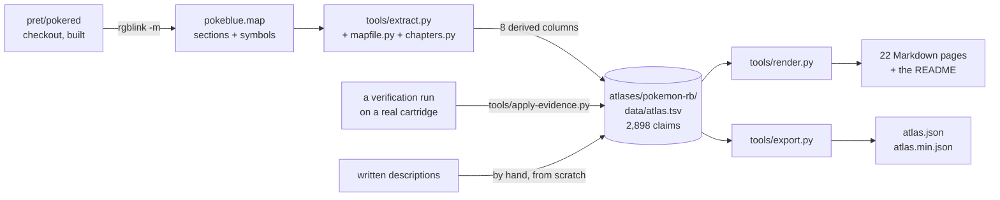

# Where this came from, and what is ours

[← AtlasGB](../README.md) · [the schema](schema.md) · [verification](verification.md) ·
[licence](licensing.md) · [adding an atlas](adding-an-atlas.md)

**Where the [Pokémon Red/Blue atlas](../atlases/pokemon-rb/) came from**, and what is ours
in it. Each atlas derives from its own disassembly, so each one has its own pipeline; this
is the first one's, and it is the shape a
[second one](adding-an-atlas.md) is expected to follow.

This page carries the provenance that used to open that atlas's `atlas.tsv` as six `#`
comment lines. It was moved here because those six lines cost the file GitHub's rendered
table view — the TSV viewer has no notion of a comment, read them as one-column rows, and
refused to render the file at all. Provenance belongs with the prose; the artefact should
be just the data.

---

## The pipeline

Eight of the ten columns are derived. Two are ours: `verify`, which arrives from a
verification run and cannot be typed by hand, and `desc`, which is written by hand and
never copied.

---

## The addresses, the names and the layouts

They come from a built [`pret/pokered`](https://github.com/pret/pokered) checkout — the
Pokémon Red and Blue disassembly — read out of the RGBDS link map that `rgblink -m`
writes beside the ROM. The map file is the only artefact that carries *both* an address
and enough structure to derive a length, which is why the atlas is built from it rather
than from the symbol file.

**The checkout must be built, and the build is checked before a single address is
believed.** [`tools/extract.py`](../tools/extract.py) re-hashes `pokeblue.gbc` and
requires SHA-1 `d7037c83e1ae5b39bde3c30787637ba1d4c48ce2` — the value pokered's own
`roms.sha1` carries for retail English Pokémon Blue (USA/Europe), and the value of the
cartridge the atlas was verified against. An unbuilt or patched checkout cannot silently
supply addresses for a different cartridge.

**Nothing from pokered is vendored here, and nothing is fetched at run time.** You point
the extractor at your own checkout, or you do not run it. `pret/pokered` is licensed under
its own terms; see [licensing.md](licensing.md) for the position this repository takes.

### Cite it like this

> Addresses, symbol names and structure layouts derived from `pret/pokered`
> (<https://github.com/pret/pokered>), read from the RGBDS link map of a build whose
> `pokeblue.gbc` matches that project's `roms.sha1`.

Where a page cites a specific fact, it cites the repository, the file and the symbol —
`pokered`'s `ram/wram.asm`, `wPartyCount` — rather than quoting anything.

---

## What is the community's

**The symbol names.** `wPartyCount`, `hRandomAdd`, `sBoxMon1` and the two thousand others
are the disassembly project's work, built up over many years by many people, and they are
the single most useful thing in this file. They are not ours and we do not claim them.
Using a name to refer to a thing is exactly what a name is for; that is why they are here
verbatim rather than renamed.

**The structure of the map** — which sections exist, where they start, what is in them —
is likewise the disassembly's, and is a fact about the cartridge in any case.

---

## What is ours

**The verification.** Every evidence tier in the `verify` column was produced by running
the cartridge and watching it, or by scanning the cartridge image, or by a named invariant
that had to be written and argued for. No other published Gen 1 memory map carries
anything of the kind. See [verification.md](verification.md).

**The completeness accounting.** The `gap` and `free` rows, and the claim that work RAM
and high RAM are 100% accounted for — 8,192 of 8,192 and 127 of 127 — are ours. They are
the difference between a list of interesting addresses and a walk of the address space.

**The chapters.** pokered's section names are an assembler's grouping and several of them
mix half a dozen unrelated subsystems, because a linker section is about where bytes
*fit*. Grouping by subject instead is editorial judgement, and it lives as reviewable
rules in [`tools/chapters.py`](../tools/chapters.py) rather than as 2,898 hand-typed
cells, so it can be argued with and re-run.

**Every word of prose.** `pret/pokered`'s comments are not ours to copy. Every `desc` in
the atlas and every paragraph on every page here is written from scratch, and where a
description asserts behaviour rather than restating a name, either an invariant covers it
or it is hedged.

---

## What is nobody's, and stays out

**No commercial ROM data, in any form.** No sprites, no text, no tables, no music, no
fragment of any of them. The cartridge's own data tables appear in the
[rom-data](../atlases/pokemon-rb/docs/rom-data.md) chapter as *addresses*, and the harness that reads them locates
them by byte signature at run time out of the player's own cartridge — the numbers are
never written down here.

**No boot-ROM content, in any form.**

**No ROM is distributed and none is fetched.** Verifying the atlas against a cartridge
requires you to supply your own.

---

## The emulator

The evidence tiers are produced by [TerminalGB](https://github.com/Alchemy86/TerminalGB),
a cycle-accurate Game Boy emulator, using the harness at `testharness/gen1atlas.rs`. That
is the only part of this work that cannot live in this repository, because proving an
address against a running cartridge needs a machine to run it on.

The relationship is one-way and explicit: TerminalGB consumes a pinned snapshot of this
atlas and publishes verification runs back to it. Neither repository is required to build
or use the other — see [consuming.md](consuming.md).

---

## Related work, credited

- [`pret/pokered`](https://github.com/pret/pokered) — the disassembly this is derived
  from. If you want to know *why* the engine does something, read it; this atlas tells you
  *where*.
- [`pret/pokecrystal`](https://github.com/pret/pokecrystal), and the wider
  [pret](https://github.com/pret) organisation, for the same work on the other
  generations.
- The Game Boy hardware community — [Pan Docs](https://gbdev.io/pandocs/), the
  [gbdev](https://gbdev.io) resources — for the address decoder this map sits inside.

We are not affiliated with any of them, and none of them has endorsed this.
