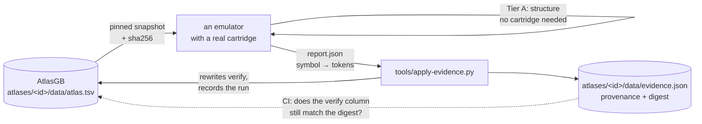

# How an entry is proved, and how the proof gets back here

[← AtlasGB](../README.md) · [the schema](schema.md) · [provenance](provenance.md) ·
[consuming it](consuming.md) · [adding an atlas](adding-an-atlas.md)

**This is the contract every atlas in the project is held to**, not a description of one
cartridge's run. The worked figures below come from the published
[Pokémon Red/Blue atlas](../atlases/pokemon-rb/); a new atlas earns its tiers the same way.

Every published Gen 1 memory map is a **transcription**: somebody read an address once and
everybody since has copied it, and there is no way, from inside any of them, to tell a
right address from a plausible one. This one is a set of **claims, each carrying its
evidence**, and this page is how the evidence is produced and how it stays true.

---

## The four tiers

They are not interchangeable, and each has a limit that is stated rather than glossed.

### R — the cartridge names it

The address appears in the ROM image as the operand of an instruction that takes one.
`ld [nn],a` is `EA lo hi`; `ldh [n],a` is `E0 n`.

This is a **byte scan, not a disassembly**. Two bytes of graphics data preceded by a byte
that happens to be `$EA` look exactly like `ld [nn],a`, so a single hit is weak — the scan
records the *count*, which for a real address is typically dozens. What it cannot do is
produce a false **negative**: an address the game really does load will be found.

### L — observed live

The byte changed while the cartridge ran a **fixed** button script on a cycle-accurate
emulator, from a cold boot with no save. Emulation is deterministic, so the same cartridge
and the same script give the same answer for anybody holding them; that is what makes it a
baseline rather than an anecdote.

The script plays the opening and then walks and opens menus, so **it never reaches a
battle or a PC**. An entry it does not mark is honestly unmarked: *not observed*, never
*not used*. Extending the script is the single highest-value contribution anybody could
make to this repository — see the end of the [README](../README.md).

### I — an invariant covers it

A named, hand-written check proved the entry **means what it says**, not merely that it
exists. These are the strongest rows in the file and the only kind that can catch an
address which is real, live, and describing the wrong thing.

| invariant | what it establishes |
|---|---|
| party arrays agree | `wPartyCount`, the flat species list and the species inside each 44-byte structure are three statements of one fact, written at different moments. All three agreeing is a claim about all three addresses. |
| party / box strides | `wPartyMon2 − wPartyMon1 = 44` and `wBoxMon2 − wBoxMon1 = 33`, taken from the atlas's own addresses. |
| battle struct is 29 bytes | Two files in the consuming emulator disagreed — 28 in one, 29 in another. The map settles it, and `wTrainerClass` following immediately is the proof. |
| money is valid BCD | Every nybble of `wPlayerMoney` is 0-9. A wrong address would almost certainly not be. |
| owned ⊆ seen | You cannot own a Pokémon you have never seen, so every bit of `wPokedexOwned` must be set in `wPokedexSeen`. **Honest limitation, measured not assumed**: the relation is symmetric when the two sets are equal, so on a save where everything seen was caught this check cannot tell the two arrays apart — swapping the symbols survives it. The check says so when that is the case, rather than reporting a pass it has not earned. |
| the party is in the Pokédex | The asymmetric version, and the strongest check here: every species you carry, converted from its **internal index** through `PokedexOrder` *read out of the cartridge*, must have its bit set in `wPokedexOwned`. Three independently located things have to agree. Shifting `PokedexOrder` by one byte breaks it, and breaks the content check beside it — measured. |
| the bag / PC lists are terminated | The count, the pairs and the `$FF` terminator must agree. |
| the live box agrees with itself | `wBoxCount`, `wBoxSpecies` and the species inside each `box_struct`, plus `wCurrentBoxNum` selecting a box that exists. |
| the player has a name | `wPlayerName` and `wRivalName` decode cleanly through the Gen 1 character map — much stronger than "the byte is not zero". |
| the map header is loaded | Width and height are in 32×32 **blocks** and the coordinates are in 16×16 **tiles**; the player must be inside the map when the factor of two is applied correctly. |
| the screen reads back as text | `wTileMap` decodes to a plausible number of letters and spaces mid-play. |
| the warp table is well formed | Every warp's coordinates are on the map whose header is loaded, which ties the table to `wCurMapHeight`/`wCurMapWidth`. |
| the RNG seed moves | Both `hRandomAdd` and `hRandomSub` change within a second of ordinary play. |
| the ROM tables are what they claim | `MonsterNames` really does start at RHYDON, `BaseStats` at Bulbasaur's 45/49/49/45/65, `PokedexOrder` at its eight known dex numbers — read straight out of the cartridge. |

**Teeth, proved rather than claimed.** Moving `wPartyCount` by one byte reddens the
ordering and alias checks; shifting `PokedexOrder` by one byte reddens both the content
check and the party cross-reference, independently. The harness caught one of its own
author's errors while it was being written: the RHYDON signature had `D` as `$84` instead
of `$83`.

An invariant is only as strong as the save it runs against, and the vacuous `owned ⊆ seen`
above is the worked example. It is recorded here because **a check that quietly passes for
the wrong reason is worse than no check**.

### · — no evidence yet

Seven storage entries carry no evidence at all. They are listed by name in
[`data/evidence.json`](../atlases/pokemon-rb/data/evidence.json) and they stay marked as unevidenced. That
honesty is the product: a map you cannot audit from the inside is the thing this
repository exists not to be.

**Counting every entry, not only storage, 60 carry no `verify` token at all** —
`atlases/pokemon-rb/data/atlas.json`, filtered on an empty `verify` array. That number is
worth pulling apart, because most of it is not a gap in the *running* of the checks; it is a
gap in what the checks are built to look at:

| what | count | why it has nothing |
|---|---:|---|
| ROM routines and data tables (`region` is `ROM0` or `ROMX`) | 53 | **Tier R (operand scan) is deliberately scoped to RAM addresses only** — it asks "does the game load *this address* as data", which is the right question for a byte of storage and the wrong one for a routine's own entry point. Tier L (live) cannot apply either: a ROM byte never changes. Three of these 53 (`MonsterNames`, `BaseStats`, `PokedexOrder`) *are* checked, by a fourth, unrelated method — a byte-signature "this table's first few bytes are what it claims" content check — and correctly show `inv`. **The other 50 have no method wired up at all**, and the honest fact is: the harness's content-check mechanism already exists and generalises (it is one match arm per symbol, see `testharness/gen1atlas.rs`'s `rom_checks`); nobody has extended it past the three tables the party/Pokédex invariants happened to need. |
| Storage bytes never touched by the fixed script (`wSprite11StateData2MapX`, `wEnemyMoveMaxPP`, `wBoxMon15Status`) | 3 | These are real WRAM addresses; the [live sweep](#l--observed-live)'s fixed script plays the opening and then walks the overworld, and never reaches a battle (`wEnemyMoveMaxPP`), a full sprite roster (`wSprite11...`), or storage (`wBoxMon15Status`). Extending the script — see below — is what closes these, not a new method. |
| Cartridge-RAM `free` markers (`sGameDataEnd`'s bank companions in the three unused SRAM banks) | 4 | These rows exist to keep the WRAM/HRAM-completeness invariant honest for cartridge RAM's structure — they assert "this byte is unallocated", not a fact about what the game stores there. A `free` row is not a claim a cartridge run can confirm or deny; there is nothing to check. |

**So of the 60, roughly 50 are "a method exists and nobody has pointed it at this symbol
yet" (the ROM content-check), 3 are "the standing method exists and hasn't reached this
byte yet" (extend the script), and 4 are not really unverified claims at all.** None of the
60 needed a new *kind* of check invented — see [the ranked hand-off](#ranked-hand-off-for-the-next-round)
below for where this sits against everything else outstanding.

---

## Confirmed against the cartridge, independently, on 2026-08-25

The tiers above are not a description of a run from the project's early days — they were
re-produced from scratch, this round, against a **second, independent boot** of the
captain's own retail Pokémon Blue cartridge and save, run twice for determinism, on
TerminalGB commit `5f61061f0565178152b93f47a0bd8d70cc3c0a15`. Both runs of the fixed
script produced byte-identical results, and both agreed with the previously-published
2026-08-15 run: **zero entries moved tier, and every invariant that had a save to check
against passed** (this run supplied one, so none were skipped for want of one, unlike a
cold-boot-only run).

That is itself the finding this round's audit was asked to produce: **the atlas's current
2,898 claims disagree with the cartridge in zero places.** `data/evidence.json`'s
`produced_by.commit` and `run.date` now record this run rather than the original one, since
it is the more recent confirmation of the same, unchanged evidence.

### Running it yourself

```bash
# from a checkout of TerminalGB (Alchemy86/TerminalGB), never edited by this project
export POKE_ROM=~/roms/pokeblue.gb          # your own cartridge; none is distributed here
export ATLAS_EVIDENCE_OUT=report.json       # optional — only if you intend to land a run
export ATLAS_EVIDENCE_DATE=$(date +%F)      # optional — dates the report by when it ran

# `--release` intermittently fails with "requires panic strategy abort" — a known,
# documented build-cache collision (docs/pitfalls/builds.md in TerminalGB), not a real
# error. `--profile quick` sidesteps it outright (panic=unwind, no LTO) and produces the
# same pass/fail/tier results — only wall-clock time differs, and no number this project
# publishes is a timing number.
cargo test --profile quick --test gen1atlas -- --nocapture

# then, back in a checkout of AtlasGB, only if the run found something new:
tools/apply-evidence.py report.json --atlas pokemon-rb && make docs data
```

Nothing about this needs a network call or a change to TerminalGB — it is exactly the
loop [above](#the-loop), run by hand instead of by a producer's own CI, which TerminalGB
does not currently schedule on a timer. **Making that scheduled** — a periodic re-run
rather than one triggered by a human remembering to — is the highest-leverage thing that
would turn this from a check anyone *can* run into a check that always has run recently;
see the hand-off.

---

## The loop

The evidence tier is this repository's most valuable property, and it is the one thing
this repository cannot produce on its own — proving an address against a running cartridge
needs an emulator. So the tiers arrive as a **report**, and the loop is closed by making
the `verify` column unwritable by hand.



### The report

A producer writes one JSON object, for **one atlas**. Every symbol in that atlas must
appear in `verify`, and every symbol in `verify` must be in it — a partial report would
silently downgrade whatever it left out, which is exactly the failure this design exists to
prevent. An **empty list means "no evidence"**, which is a claim the report is making, not
an omission.

```json
{
  "schema": "atlasgb-evidence/1",
  "atlas": "pokemon-rb",
  "produced_by": {"repo": "…", "commit": "…", "harness": "…"},
  "cartridge":   {"title": "POKEMON BLUE", "region": "USA/Europe", "sha1": "…"},
  "script":      {"name": "opening+overworld", "frames": 3600, "save": "none (cold boot)"},
  "run":         {"date": "2026-08-15"},
  "verify": {
    "wPartyCount": ["rom", "live", "inv"],
    "wBoxMon15Status": []
  }
}
```

`atlas` names which atlas the run is about. It is optional — a report without it lands
into whatever `--atlas` says, so reports written before the project grew a second cartridge
keep working — but emit it. With more than one atlas in the repository, a report that does
not say which cartridge it is about is one mis-typed flag away from attributing one
cartridge's evidence to another, and `apply-evidence.py` refuses the mismatch only if the
report states its position.

Land it:

```bash
tools/apply-evidence.py report.json --atlas pokemon-rb
make docs data          # the pages and the JSON carry the new counts
```

### Why it cannot go stale

Each atlas's `data/evidence.json` — for Red/Blue,
[this one](../atlases/pokemon-rb/data/evidence.json) — records the provenance of the last
run landed into it **and a SHA-256 digest of the `verify` column it produced**.
`tools/apply-evidence.py --check` recomputes that digest for **every** atlas and runs in
CI, so:

- editing an evidence token by hand turns CI red;
- adding a symbol to the atlas without re-running the verification turns CI red, because
  the new symbol changes the digest;
- a tier in the published atlas therefore always names a **real run against a real
  cartridge**, identified by its commit and the cartridge's SHA-1.

The digest is over `symbol → verify` only, deliberately. Writing a new description or
rewording a chapter must not invalidate a verification run, because neither changes what
was proved.

---

## What runs where

| check | needs a cartridge? | where it runs |
|---|:--:|---|
| the file parses; regions, roles and tokens are from the vocabulary; addresses are inside their regions; ordering and extents; **work RAM and high RAM fully accounted for**; the JSON matches its schema; every link and anchor resolves | no | **here**, on every push — [`tools/validate.py`](../tools/validate.py), [`tools/checklinks.py`](../tools/checklinks.py) |
| the `verify` column matches the last landed run | no | **here**, on every push — `tools/apply-evidence.py --check` |
| R — operand scan over the ROM image | ROM only | the consuming emulator |
| L — the live sweep | ROM + emulator | the consuming emulator |
| I — the invariants | ROM + emulator (+ a save for some) | the consuming emulator |
| **the anti-drift gate**: every Gen 1 address hard-coded in a consumer's source is in the atlas | no | the consumer — see [consuming.md](consuming.md) |

The split is the honest one. Everything that can be proved from the file itself is proved
here, in this repository's CI, on every push; everything that needs a machine is proved by
the machine and published back.
